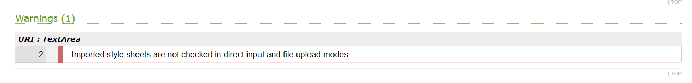

## Objectives
The objective was to design an interactive online quiz to demonstrate ability with HTML, CSS and Javasript. The Quiz should be intuative and offer a high level of interactivity.
I will create a multiple choice quiz which displays the sillouttes of a country and offer the user a choice of four answers. Points will be awarded for correct answers. To add interest, bonus points will be awarded for getting five correct consecutive answers. The player will have 20 turns to score as many questiona as they can.

## Scope
The quiz will focus on asking questions related to country sillouttes. This focus will help give it a strong identity with the objective of distingushing it from other quizzes.

## Structure
The quiz will be on a single page for simplicity. I will try and structure it to minimise scrolling. I will prioritise mobile design as I expect most users to use it to pass time while on the go. A silloutte of the country will be displayed to the user. Appropriately titled buttons will allow the user to interact with the quiz in an intuative and tactile way. I will use buttons as this will support users with touchscreens and prevent issues with people entring correct, but icorrectly spelled answers.

## Skeleton
Wireframe

## Surface
I will keep the appearence of the quiz simple, with bold colours. When the user answers a question I will provide feedback in with a green tick or a red cross to support intuative interaction. 

## The final site
This is the initial view of the final site on mobile.  

This is the view of the above once the 'let's play button' is clicked.  

This is the initial view on a large screen.

This is the view of the above when the 'let's play' button is clicked.

### Testing
#### Manual user testing
A bug was found whereby the "Show me another country" button would increment the score, but not trigger the function ending the game after 20 turns. This allowed players on the 20th question to click the button multiple times and be re-asked the question, meaning they could wait until a question they could answer came up. This could lead to crashing the game if the player clicked the button until all maps had been displayed, and also makes the programme seem incomplete. I corrected this by adding code to automatically end the game once the question tracker reached 21.

In the earlier versions of the site, the answer select buttons appeared at the bottom of the page. This meant that on some screens some or all of the buttons were cut off at the bottom, necessitating scrolling. In the worst cases the third or fourth button (which had the correct answer) was cut off. This caused confusion as it was not obvious the user needed to scroll. Some restyling of padding and margins helped, however shrinking the size of the elements too much would also decrease user experience. In the end, I created space by moving the 'Show me another country' to the bottom, as it is less important when the answer select buttons are visible. 

### Validation
#### HTML
The HTML was tested with the [w3 validator](https://validator.w3.org/nu/#textarea). It suggested the sections either be given titles or replaced with div's. I added headings but set display to none to hide them. This is more sutable for users with screen readers.

The page passes through the w3 validator with no issues.

#### CSS
The page has passed through the [w3 CSS validator](https://jigsaw.w3.org/css-validator/) with no errors and one warning. As the warning relates to the inability of the validator to check imported code (in this case Google fonts), this acceptable.

#### Javascript
The page passes through [JS hint](https://jshint.com/) showing one unused variable, the answerQuestion() function on line 143. This is because the function is being called by an onclick function which is added to the HTML (line 89), thus the warning is not an issue.

#### Lighthouse

## Deployment
The application was created on Gitpod using The Code Institute template (https://github.com/Code-Institute-Org/gitpod-full-template) and VS Code Plugin and deployed to Github with the following steps:

* Login to Github, otherwise create an account.
* Navigate to the repository ('Explore -> 'ewradcliffe/Guess-the-country') or follow the link (https://github.com/ewradcliffe/Guess-the-country).
* Once in the repository navigate to the 'Settings' tab.
* Navigate to the 'Pages' section, select the branch to deploy and save the changes.

The site can be deployed from gitpod. To run the programme:
*  Enter the command "python3 -m http.server" in the terminal and open the new tab when prompted. * Alternatively, while the programme is running select [link to the port](https://8000-ewradcliffe-guessthecou-csiyzn2swi2.ws-eu114.gitpod.io) on the port tab in VS code.

The link to website is https://ewradcliffe.github.io/Guess-the-country/

Please note that to save any changes:
* Save as usual
* To commit changes, enter 'git add .' in the teminal and then enter 'git commit -m "summerise changes."
* Once all changes are made use the command 'git push' to push changes to github.

## Credits
* Random number selector taken from https://www.geeksforgeeks.org/how-to-select-a-random-element-from-array-in-javascript/

* Fonts from https://fonts.google.com/

* Tick and cross from https://fontawesome.com/

* Country sillouttes from https://silhouettegarden.com/category/country/

* Favicon generated by Favicon generator https://www.favicon-generator.org/ 

* Header background from https://www.pexels.com/

* Code for onclick Display Buttons in https://www.geeksforgeeks.org/how-to-get-the-id-of-the-clicked-button-using-javascript-jquery/

